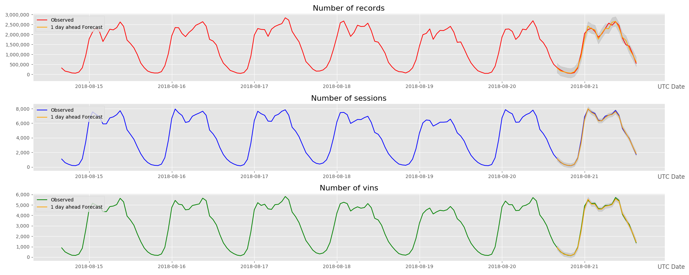

# Data Scientist Capstone

I would choose my own project as the Data Scientist Capstone project - It is in Data Scientist scope but not a very "popular" area: Time Series data monitoring and forecast. 

## Problem Statement 

Currently more and more real-time data have been integrated into Datalake platform, but I don’t have an automatic and free tool to able to monitor the status for the real-time data ingestion. This project aims to develop a smart monitoring tool to improve current situation.

This project has been devided into two phases:  

* Phase 1 - Mainly focus on the basic functionalities to monitor the data ingestion status. For specific cases, e.g.connection lost, empty data, etc. system will automatically send email to appointed email address, a short description for the issue and a general data chart will be attached.   
* Phase 2 - Has extended the functionalities to be able to detect the real-time data ingestion in a normal pattern, or abnormal pattern by leveraging ML technologies. We trained a Time Series Model based on ARIMA, and based on that get 1 day ahead forecast. The chart we plotted looks like as below:   

## The Data
The dataset we are using is `data\telematics_data.csv`, It was collected from huge number of real cars, and then has been aggregated in every hour (not the Raw Telematics data).   
The data structure look like this:   

dd,day_hour,num_records,num_sessions,num_vins
2017-12-28,5,36851,569,535
2017-12-28,6,80184,872,750
2017-12-28,7,36796,391,374
2017-12-28,9,1450,85,85
2017-12-28,10,20005,549,518

## Analysis process 

SARIMAX is leveraged as Time Series Model to forecast the data status. Below is the overall procss in this project. 
 

## Model Fitting and Evaluation 
* An automatic “grid-search” approach is used to choose parameters with lowest AIC
* ARIMA(p,d,q)(P,D,Q)s alter depends on the data and period we choose, so we have to train it every time before forecast 
* Right now we are using 1 month data to train, and forecast the data1 day ahead
* And choose daily periodicity (s=24) for fitting the time series

## Configuration

1. The E-mail functionality, training data period, and thresholds of the model can be configured by editing the JSON file in `conf/config.json`
2. The home directory of the application is defined in `main.py` under the variable `app_dir`, this should be changed to the applications root structure before running.

## Running

The submission scripts also have hard coded application directories, so make sure to edit those before you run them.

After making the necessary configurations you can run the application by using `python src/telematics_monitoring.py`.

## Scheduling

In this project, I read data from a csv file. But in real case I need to run few queries to ingest data from external data sources. In that case, I have to update the `data acquire` part in the program, and schedule regular jobs to run it every day.  

## Conclusion

#### What went well
* The status of Telematics data ingestion is getting transparent, and data issues can be informed & handled within 1 day. 
* The approach & experience we learned in this project can be applied or referred in other cases in the further (e.g. Infrastructure data monitoring, Sales forecast, etc.) 

#### Things can be improved
* The forecast during the weekend, and public holidays is not very accurate. (We have tried to involve longer history data and extend periodicity from daily to weekly, but it takes much more time to train the model) 
* In case there are data lost, and we did not reload it again, the final forecast accuracy will also be impacted.

